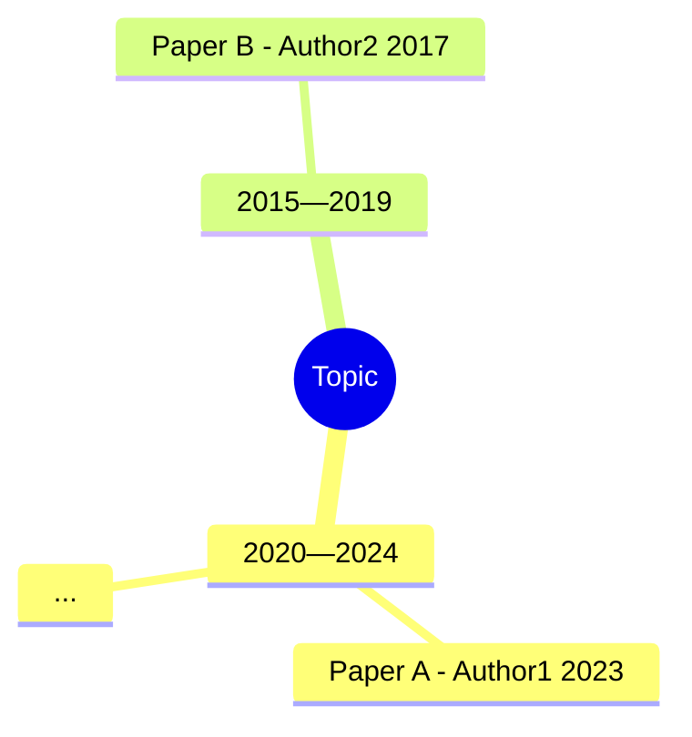

# Scientific Research — Literature Review Skill

> **Systematic literature research across multiple academic sources, with intelligent filtering, DOI verification, and one-click Markdown report generation.**

This is a Claude Code skill that performs **exploratory research** on any scientific direction. Given a natural-language research question (in English or Chinese), it automatically searches academic databases, deduplicates and verifies results, filters for relevance using LLM-based semantic evaluation, and generates a structured desktop report — all in one command.

## Quick Example

> **User**: "帮我调研一下扩散模型在蛋白质设计中的发展脉络"
>
> **Result**: A Markdown report saved to `~/Desktop/扩散模型在蛋白质设计中的发展脉络领域发展脉络调研.md` containing:
> - An overview of the field and literature scale
> - Curated anchor (classic) papers with scoring breakdowns
> - A structured citation tree (foundational works → anchor → recent developments)
> - A complete literature table (year, title, venue, DOI, sources)
> - A Mermaid mind map visualizing the timeline

## How It Works

```
User query (EN/CN)
       │
       ▼
┌──────────────────────────┐
│  Step 1: Intent Parsing  │  Extract entities (modality, organ, task)
│  & Query Augmentation    │  via ontology + LLM fallback for ambiguous terms
└────────────┬─────────────┘
             │
             ▼
┌──────────────────────────┐
│  Step 2: Multi-Source    │  Query arXiv / CrossRef / PubMed / Semantic
│  Literature Search       │  Scholar in parallel (3–4 sources)
└────────────┬─────────────┘
             │
             ▼
┌──────────────────────────┐
│  Step 3: DOI Anchoring   │  Resolve every record against CrossRef;
│  & Verification          │  cross-check title + author + year
└────────────┬─────────────┘
             │
             ▼
┌──────────────────────────┐
│  Step 4: Deduplication   │  Collapse by DOI → arXiv ID → PMID →
│                          │  normalized title+year; merge metadata
└────────────┬─────────────┘
             │
             ▼
┌──────────────────────────┐
│  Step 5: LLM Batch       │  Pack all papers into one Claude API call.
│  Filtering               │  Returns [true, false, ...] per paper.
│                          │  Excludes semantically irrelevant results.
└────────────┬─────────────┘
             │
             ▼
┌──────────────────────────┐
│  Step 6: Report & Mind   │  Auto-generate Markdown report + Mermaid
│  Map on Desktop          │  mind map to ~/Desktop
└──────────────────────────┘
```

## Key Features

### 1. Multi-Source Academic Search
Searches **4 major academic databases** simultaneously with no API keys required:

| Source | Coverage | Best For |
|--------|----------|----------|
| **arXiv** | CS / AI / ML / Physics | Preprints and rapid communication |
| **CrossRef** | All disciplines | DOI resolution and metadata enrichment |
| **PubMed** | Biomedical / Clinical | Life sciences and medical research |
| **Semantic Scholar** | Cross-disciplinary | Citation graphs and broad coverage |

A smart **field router** automatically selects the best 3 sources for your topic:

| Topic Field | Primary → Secondary → Tertiary |
|---|---|
| Biomedical / clinical | PubMed → Semantic Scholar → CrossRef |
| CS / AI / ML | arXiv → Semantic Scholar → CrossRef |
| Physics / Math / Astronomy | arXiv → Semantic Scholar → CrossRef |
| Chemistry / Materials | CrossRef → Semantic Scholar → PubMed |
| Social Science / Humanities | CrossRef → Semantic Scholar → (skip arXiv/PubMed) |
| Cross-disciplinary / unsure | Semantic Scholar → CrossRef → arXiv |

### 2. Medical Imaging Intent Parsing (Specialized Module)

For medical-imaging queries, the skill performs **dual-layer entity extraction**:

- **Rule-based** — scans against a built-in medical ontology (modalities, organs, tasks) with rich synonym support
- **LLM fallback** — invokes Claude API to extract organs the synonym map misses

It also supports:
- **Query augmentation**: "超声" → adds "ultrasound us echography" to the search
- **NOT clause injection**: "Ultrasound Lung" → automatically adds `NOT CT NOT MRI` to the query
- **Entity deficiency detection**: If the query lacks required entities (e.g., "find segmentation papers" with no organ or modality specified), it prompts the user for clarification
- **LLM batch filtering**: Semantically evaluates each paper's relevance to the user's intent, correctly excluding e.g. "breast cancer" papers when searching for "ovarian cancer"

### 3. Anchor Paper Scoring

Anchors the literature review with **1–3 foundational papers** identified via a multi-dimensional scoring function:

```
Score = w1 · ln(Citations + 1) · time_decay(Year) · venue_weight
      + w2 · local_relevance
      + w3 · co_citation_network_boost
```

- **Time-decay normalization**: Prevents ancient papers from dominating purely on citation count
- **Venue tiering**: Nature/Science (tier 5) down to major conferences (NeurIPS, CVPR, MICCAI at tier 1)
- **Co-citation density**: Papers frequently cited by the retrieved set get a bonus, surfacing "dark horse" anchors

### 4. Citation Tree

For the top anchor paper, builds a structured citation lineage:

- **Backward**: Extracts references → filters to the most influential prior works (technical foundations)
- **Forward**: Queries "Cited By" → ranks by recency + citation strength (SOTA evolution)
- **Visualization**: Renders as both a text tree and a Mermaid flowchart

### 5. Strict Veracity Guarantee

- **No fabricated DOIs**: Every citation maps to a real, verifiable publication
- **DOI anchoring**: Each record is cross-checked against CrossRef (title + first author + year)
- **Unverified records are flagged** (`verified: false`) but retained, not silently dropped
- **Missing = missing**: Unknown fields are left empty rather than guessed

### 6. One-Click Markdown Report

Generates a complete research report on the user's Desktop in seconds:

```markdown
# [Topic] 领域发展脉络调研

> 自动生成于 2026-06-25 10:30
> 检索 query: "diffusion models protein design"
> 数据源: arxiv, semantic_scholar, crossref
> 原始记录 342 条 → 去重后 87 条

## 0. 经典文献推荐 / Anchor Papers
- [Score, breakdown, venue, citation count]

## 1. 领域概览 / Overview
...

## 2. 文献列表 / Literature List
| # | Year | Title | Venue | DOI | Sources |
|---|------|-------|-------|-----|---------|

## 3. 思维导图 / Mind Map

```

## Output Formats

- **Markdown report** (default, `--report`): The full desktop deliverable with overview, tables, and mind map
- **JSON**: Machine-readable search results with metadata
- **BibTeX / RIS / NLM (.nbib)**: For import into reference managers
- **Mermaid**: Embedded mind maps and citation trees renderable in VS Code, GitHub, Obsidian, and Typora

## Tech Stack

- **Python stdlib only** — zero `pip install` dependencies
- **Pure HTTP** — uses `urllib` with retry, exponential backoff, and rate limiting
- **HTTP cache** at `~/.cache/scientific-research/` to avoid redundant API calls
- **No external LLM needed** for core search/dedup — LLM is only used for semantic filtering (optional)

## File Structure

```
scientific-research/
├── SKILL.md                          # Skill definition and agent instructions
├── scripts/
│   ├── search-literature.py          # Main orchestrator (CLI entry point)
│   └── lib/
│       ├── sources/                  # Per-source API clients
│       │   ├── arxiv.py
│       │   ├── crossref.py
│       │   ├── pubmed.py
│       │   └── semantic_scholar.py
│       ├── report.py                 # Markdown report generator
│       ├── anchor_scorer.py          # Multi-dimensional classic paper scoring
│       ├── citation_tree.py          # Citation lineage (backward/forward)
│       ├── medical_synonyms.py       # Medical imaging ontology + synonyms
│       ├── paper.py                  # Record schema & dedup logic
│       ├── verify.py                 # DOI anchoring & retraction check
│       ├── export.py                 # BibTeX/RIS/NLM/JSON exporters
│       └── http.py                   # Rate-limited HTTP client with cache
└── .gitignore
```

## Environment Variables

| Variable | Purpose |
|---|---|
| `ANTHROPIC_API_KEY` | Required for LLM batch filtering (semantic paper relevance) |
| `LLM_BATCH_FILTER=0` | Disable LLM filtering entirely |
| `SCI_RESEARCH_CACHE` | Override HTTP cache directory |
| `SCI_RESEARCH_REPORT_DIR` | Override report output directory (default: Desktop) |
| `SCI_RESEARCH_MAILTO` | Polite pool email for CrossRef API |
| `SEMANTIC_SCHOLAR_API_KEY` | Higher rate limits for Semantic Scholar |
| `NCBI_API_KEY` | Higher quotas for PubMed |

## Limitations

- **Google Scholar / CNKI / 万方** lack public APIs — use WebSearch/WebFetch manually for these
- **Preprints** may later appear in journal form; citation counts can lag
- **Rate limits**: Semantic Scholar (~100 req / 5 min unauthenticated); arXiv (≥3s between calls)
- **China mainland network**: Semantic Scholar / arXiv / NCBI may be slow; each source auto-retries 3 times then silently skips. CrossRef is most reliable.

## License

[Add your license here]
