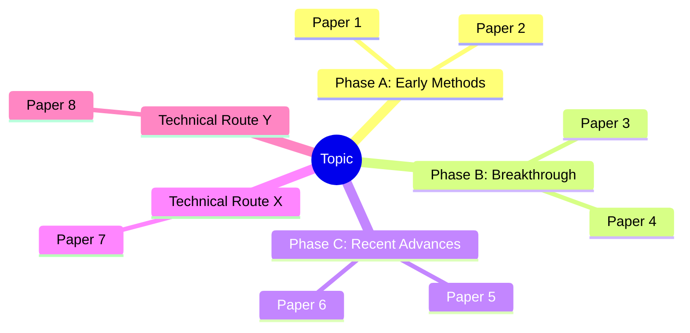
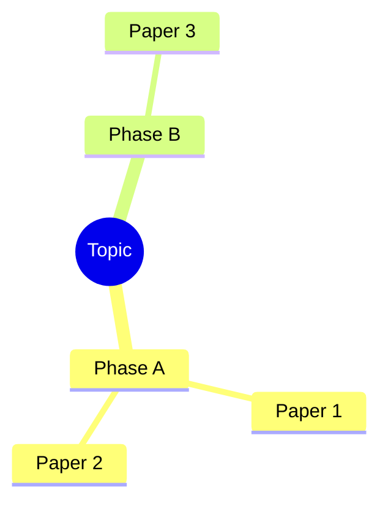

# Scientific Research Literature Review

Systematically research a scientific direction, find relevant literature, and clarify
the development trajectory. This skill is for **exploratory research** — when the user
wants to understand a field, not just find a few papers.

## Core Principles (Read First)

1. **Never fabricate papers.** Every citation must correspond to a real, verifiable publication.
2. **Stay on topic.** Only include papers directly relevant to the user's research direction.
3. **Verify every source.** Each paper must have a working, traceable access URL (DOI link, arXiv link, or publisher page).
4. **Cite sources you query.** Tell the user which databases/sources you searched and why.

## Workflow

### Step 1: Clarify the Research Direction

Ask the user to specify:
- **Research topic/direction** (required) — e.g., "diffusion models for protein design"
- **Scope preferences** (optional) — time range, sub-fields, paper types (surveys, seminal papers, recent work)
- **Output format** (optional) — chronological, by technical route, or combined

If the topic is too broad, suggest narrowing it. If too narrow, note that fewer results may be available.

### Step 2: Search Literature

Use available research tools to search across multiple sources. Follow the source routing table in `references/search-reference.md`.

**MCP Tools Available:**
- `PubMed` — For biomedical/life sciences research (multi-source literature search, citation verification, MeSH strategy)
- `nature-citation` — For adding Nature/CNS journal citations
- `WebSearch` / `WebFetch` — For Google Scholar, CNKI, and general web-based academic search

**Source Routing Table (from references):**

| User's field | Primary source | Secondary | Fallback |
|---|---|---|---|
| Biomedical / life sciences | PubMed | Semantic Scholar | CrossRef |
| CS / AI / ML | arXiv | Semantic Scholar | Google Scholar (web) |
| Physics / math | arXiv | Semantic Scholar | CrossRef |
| Chemistry | CrossRef | Semantic Scholar | PubMed |
| Cross-disciplinary | Semantic Scholar | CrossRef | Google Scholar (web) |
| Engineering / general | Semantic Scholar | CrossRef | Google Scholar (web) |

**Search strategy:**
1. Identify the user's field to select primary source (see table above).
2. Start with the most specific query based on the user's topic.
3. Broaden if results are too few. Use synonyms, acronyms, and broader MeSH terms.
4. Use the `scripts/search-literature.py` helper or MCP tools for structured queries.
5. For each paper found, **verify** it exists by checking at least one source (DOI resolution, publisher page, or arXiv page).
6. If no MCP tools are available, search manually via WebSearch + WebFetch.

### Step 3: Organize by Development Trajectory

Present findings using **one or both** of these dimensions:

**Chronological view** (time route):
- Group papers by era / phase of development
- Identify pivotal papers that shifted the direction
- Mark when new methods, theories, or datasets emerged

**Technical route view** (method route):
- Group by sub-approach or methodology
- Show how different techniques diverged or converged
- Identify which routes are dominant, dormant, or emerging

You may combine both: chronological groups within each technical route.

### Step 4: Generate a Mind Map (Mermaid)

After organizing the literature, create a **Mermaid mindmap** to visualize the development trajectory. This is a text-based diagram that renders in Markdown viewers that support Mermaid.



Guidelines:
- Root node = the research topic
- First-level children = phases or technical routes
- Second-level children = key papers within each branch
- Keep labels concise: use paper short-form (e.g., "CNN-based, 2018")
- If the field is small (<10 papers), a simplified mindmap is sufficient

### Step 5: Present Results

For each paper, provide:

```
[Year] **Title**
Authors: Author1, Author2, Author3
Venue: Journal/Conference Name
Links: DOI: https://doi.org/xxxxx | arXiv: https://arxiv.org/abs/xxxx.xxxxx | Publisher: [URL]
Summary: 1-2 sentences on what the paper did and why it matters.
```

After listing individual papers, provide a **synthesis section**:

- **Key milestones** — 3-5 papers/events that fundamentally changed the field
- **Paradigm shifts** — when the community moved from one approach to another
- **Current state** — what the consensus is, what's actively debated
- **Research gaps** — areas that are underexplored or emerging
- **Suggested next reads** — 2-3 recent papers or surveys for staying current

## Output Structure

```markdown
## Literature Review: [Topic]

### Overview
Brief description of the field, its size, and main themes.

### Development Timeline / Technical Routes

#### Phase / Route A: [Name]
| # | Year | Title | Authors | Venue | Links | Summary |
|---|------|-------|---------|-------|-------|---------|
| 1 | 2020 | ... | ... | ... | DOI, arXiv | ... |

#### Phase / Route B: [Name]
...

### Key Milestones
1. ...
2. ...

### Research Gaps & Emerging Directions
- ...

### Recommended Survey Papers
- ...

### Mind Map

```

## Source Verification Checklist

For every paper included, confirm:
- [ ] Title, authors, and year are correct
- [ ] DOI or equivalent ID is resolvable
- [ ] At least one access link works (DOI link, arXiv, or publisher page)
- [ ] The paper is genuinely relevant to the stated research direction
- [ ] The venue/journal name is accurate

If you cannot verify any of these, **do not include the paper**.

## Using the Helper Script & MCP Tools

### Option A: MCP Tools (Preferred)

If the PubMed or paper-search MCP tools are available, use them directly for structured queries:

**PubMed MCP:**
```
Tool: PubMed search
Query: [your topic keywords]
Filters: year range, publication type, species
```

**WebSearch / WebFetch for Semantic Scholar:**
You can use WebSearch to query Semantic Scholar's public search endpoint:
```
Search: "https://api.semanticscholar.org/graph/v1/paper/search"
Query: multi-author, multi-year, citation-aware
```

### Option B: Helper Script

The helper script (`scripts/search-literature.py`) provides a template for structuring search queries. You can copy its logic for API calls but you'll need to implement the actual HTTP requests:

```bash
python "C:\Users\JackyHuang\.claude\skills\scientific-research\scripts\search-literature.py" \
  --query "diffusion models protein design" \
  --source semantic_scholar \
  --max-results 20
```

The script outputs structured JSON. Parse it and verify each result before including in the report.

### Option C: Manual Web Search

If no MCP tools or scripts are available:
1. Use WebSearch to query Google Scholar, arXiv, PubMed, or Semantic Scholar
2. Use WebFetch to load individual paper detail pages for verification
3. Extract title, authors, year, venue, DOI, and abstract
4. Apply the same verification standards

## Error Handling

- **No results found**: Broaden query terms, try synonyms, suggest related topics.
- **API / search failure**: Report the failure, continue with remaining sources.
- **Uncertain citation**: When in doubt, exclude the paper rather than risk fabricating.

## Limitations

- Some sources (Google Scholar, Semantic Scholar) use scraping — results may be incomplete or rate-limited.
- Chinese-language literature (CNKI, 万方) may not appear in Western databases — supplement with Chinese sources when relevant.
- Citation counts may be delayed (CrossRef updates monthly, Google Scholar may lag).
- Preprint papers may later appear in journal form — note this when applicable, use the published venue if available.
- Paywalled content: If a paper's full text is behind a paywall, only cite the metadata (title, authors, DOI) — never fabricate abstracts or summaries from paywalled papers you cannot access.
- Semantic Scholar API rate limit: ~100 requests/5 minutes for unauthenticated, ~1000 for authenticated.
- Always prefer verified data over plausible-sounding estimates. When uncertain about citation counts or venue impact factors, state that explicitly rather than guessing.
