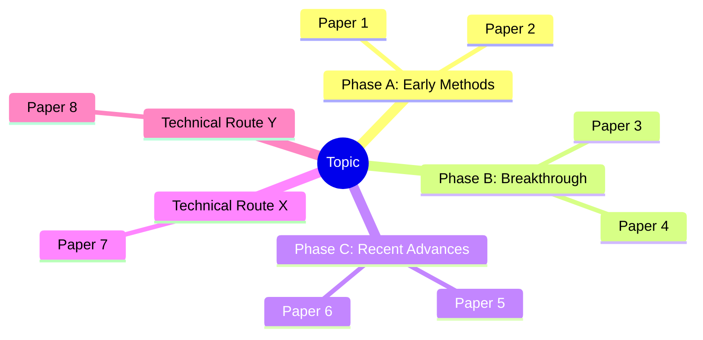
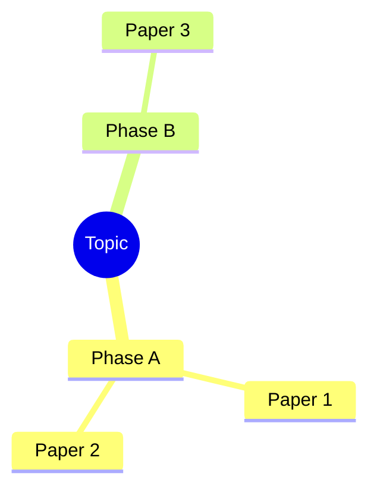

# Scientific Research Literature Review

Systematically research a scientific direction, find relevant literature, and clarify
the development trajectory. This skill is for **exploratory research** — when the user
wants to understand a field, not just find a few papers.

## Core Principles (Read First)

1. **Never fabricate.** Every citation must correspond to a real, verifiable
   publication. **Never invent a DOI** or any other identifier.
2. **Missing means missing.** If a metadata field (DOI, volume, issue, pages,
   etc.) cannot be retrieved, leave it empty in JSON output and render it as
   the literal string `"missing"` in human-readable formats. Do not guess.
3. **DOI-anchor every record.** Each paper that has a DOI is resolved against
   CrossRef and cross-checked on title + first-author surname + year. Records
   that fail anchoring are flagged `verified: false`.
4. **DOI-first deduplication.** When merging results from multiple sources,
   collapse by DOI (then arXiv id, PMID, normalized title+year) and keep the
   record with the most complete metadata. Source attributions are unioned.
5. **Stay on topic.** Only include papers directly relevant to the user's
   research direction.

## Operating Mode (Agent-Driven, NOT user-driven)

**The user must NEVER be asked to run any shell command.** This skill is fully
agent-driven: once the user states their research direction in natural language
(e.g., "帮我调研一下扩散模型在蛋白质设计中的发展脉络"), Claude Code itself
decides every CLI argument, executes the orchestrator via `run_command`, and
delivers the report. The user only sees:

  1. A short confirmation of the topic Claude Code interpreted.
  2. The path to the generated `<topic>领域发展脉络调研.md` on their Desktop.
  3. Optional follow-up narrative summary.

**Never** print a command and tell the user to run it. **Never** stop at "you
can run …". If the user has stated a topic, run the pipeline immediately.

## Workflow

### Step 1: Interpret the Research Direction (silent)

Read the user's natural-language request and **decide internally**:

- **English query** (`--query`): translate / refine the user's wording into a
  concise English search string (sources index in English). Drop polite filler
  ("帮我调研一下", "I want to know about"). Keep technical specifics.
- **Topic label** (`--topic`): the user-facing name shown in the report title
  and filename. Default to a short Chinese phrase if the user wrote in Chinese,
  otherwise the English query. Used in `<topic>领域发展脉络调研.md`.
- **Sources** (`--sources`): pick from the routing table below based on the
  topic's field. Default to **3 sources** for breadth + cross-validation.
- **Max results per source** (`--max-results`): default 25. Bump to 40 for
  broad / well-established fields, drop to 15 for narrow niches.
- **Year range** (`--year-from / --year-to`): only set if the user explicitly
  asked for "recent / 近几年" (then `year_from = currentYear - 5`) or named a
  window. Otherwise leave open.
- **Type filter** (`--type`): leave as `all` unless the user asked specifically
  for "reviews / 综述" or "preprints".

Only ask a clarifying question if the topic is genuinely ambiguous (e.g., bare
acronym with multiple meanings). One question max; if the user answers vaguely,
make your best guess and proceed.

#### Source Routing Table (used by Step 1's source-decision logic)

| Topic's field | Primary | Secondary | Tertiary |
|---|---|---|---|
| Biomedical / life sciences / clinical | pubmed | semantic_scholar | crossref |
| CS / AI / ML / NLP / CV | arxiv | semantic_scholar | crossref |
| Physics / math / astronomy | arxiv | semantic_scholar | crossref |
| Chemistry / materials | crossref | semantic_scholar | pubmed |
| Engineering / robotics / signal | semantic_scholar | crossref | arxiv |
| Social science / humanities | crossref | semantic_scholar | (skip arxiv/pubmed) |
| Cross-disciplinary / unsure | semantic_scholar | crossref | arxiv |

**Default**: pick the top-3 sources for the matched field and pass them all in
one invocation. Picking only one source is forbidden unless the topic clearly
fits a single domain (e.g., pure-math → arxiv only).

### Step 2: Execute the Pipeline (silent)

Invoke the orchestrator with `run_command`. There is exactly one canonical
shape:

```bash
python3 /Users/<user>/.comate/skills/scientific-research/scripts/search-literature.py \
  --query "<refined English query>" \
  --topic "<user-facing topic name>" \
  --sources "<chosen,sources>" \
  --max-results <N> \
  [--year-from <Y>] [--year-to <Y>] [--type review] \
  --report \
  --quiet
```

Notes for the agent:
- Use the absolute path of `search-literature.py` in this skill's directory
  (it is symlinked / installed under the user's Comate skills tree). Resolve
  the path from `__file__` of the skill, never hard-code a username.
- Always pass `--report` (this is the deliverable).
- Always pass `--quiet` so the user only sees the final `[report] <path>` line.
- Capture stdout; the last line is the report path.
- If the script exits non-zero, retry once with a single fallback source
  (`crossref` is the most reliable). If that also fails, surface a concise
  error and the partial output (if any).

The orchestrator handles internally: rate-limiting, retry, HTTP cache, DOI
anchoring against CrossRef, retraction detection, dedup, mindmap and report
generation, and writing to the Desktop.

### Step 3: Confirm Delivery and Add Narrative

After the script returns:

1. Read the generated Markdown file with `read_file` to verify it exists and
   has non-empty §2-§5 (Timeline / Routes / Milestones / Mindmap).
2. If `unique_count` is unusually low (< 5) or high (> 80), re-run once with
   adjusted `--max-results` or sources. Do this without asking the user.
3. Open the file and **fill in §6 Synthesis prose in-place** using `edit_file`:
   - Base every claim on rows already present in the report's tables.
   - Do not introduce papers not in the table.
   - Keep §6.4 Research Gaps strictly evidence-backed (per Step 6.D below).
4. Reply to the user with:
   - A one-paragraph executive summary of what was found.
   - The absolute path to the report on their Desktop, formatted as
     `file_path:line_number` so the IDE makes it clickable
     (e.g., `~/Desktop/扩散模型在蛋白质设计中的发展脉络领域发展脉络调研.md:1`).
   - The Self-Review Report block (Step 6).

**Do NOT** dump the entire report into chat — the user already has the file.

### Step 4: Self-Review Loop (MANDATORY)

(See the detailed checklist further below in §"Step 6: Self-Review Loop".)
Run it before sending the final reply. If a check fails, fix the file with
`edit_file` and re-check.

---

## Legacy Reference: Pipeline Internals

The sections below describe what the orchestrator does internally. The agent
never asks the user to invoke any of this manually.

### Search Literature (script behaviour)

`scripts/search-literature.py` is the orchestrator. It handles rate-limiting,
retry, on-disk caching, DOI anchoring against CrossRef, dedup, and export.
Source routing follows the table in §"Operating Mode" above.

**Implemented sources (HTTP, no key required):**
- `arxiv` — arXiv Atom API
- `crossref` — CrossRef Works API (set `SCI_RESEARCH_MAILTO` for polite pool)
- `pubmed` — NCBI E-utilities (set `NCBI_API_KEY` for higher quotas)
- `semantic_scholar` — Semantic Scholar Graph API (set `SEMANTIC_SCHOLAR_API_KEY` if available)

### Organize by Development Trajectory (script behaviour)

Present findings using **one or both** of these dimensions:

**Chronological view** (time route):
- Group papers by era / phase of development
- Identify pivotal papers that shifted the direction
- Mark when new methods, theories, or datasets emerged

**Technical route view** (method route):
- Group by sub-approach or methodology
- Show how different techniques diverged or converged
- Identify which routes are dominant, dormant, or emerging

You may combine both: chronological groups within each technical route.

### Step 4: Generate a Mind Map (Mermaid)

After organizing the literature, create a **Mermaid mindmap** to visualize the development trajectory.



Guidelines:
- Root node = the research topic
- First-level children = phases or technical routes
- Second-level children = key papers within each branch
- Keep labels concise: e.g., "CNN-based, 2018"

### Step 5: Present Results

For each paper, provide:

```
[Year] **Title**
Authors: Author1, Author2, Author3
Venue: Journal/Conference Name (vol/issue/pages — fields shown as "missing" if unavailable)
DOI: 10.xxxx/xxxxx (or "missing" if no DOI exists for this record)
Other links: arXiv:xxxx.xxxxx | PMID:xxxxxx | PDF:[URL]
Verified: yes/no — anchored to CrossRef
Summary: 1-2 sentences on what the paper did and why it matters.
```

After listing individual papers, provide a **synthesis section**:

- **Key milestones** — 3-5 papers/events that fundamentally changed the field
- **Paradigm shifts** — when the community moved from one approach to another
- **Current state** — what the consensus is, what's actively debated
- **Research gaps** — areas that are underexplored or emerging
- **Suggested next reads** — 2-3 recent papers or surveys for staying current

### Step 6: Self-Review Loop (MANDATORY before delivering)

This is a **hard gate**. Do not present the review to the user until every
item below is explicitly checked. If any item fails, fix the underlying issue
(re-search, re-verify, drop the paper, or rewrite the section) and re-run the
checklist. Append the completed checklist to your final answer so the user can
audit it.

**A. Citation truthfulness**
- [ ] Every cited paper has either `verified: true` (DOI anchored to CrossRef)
      or a manually inspected publisher/arXiv/PubMed URL noted alongside it.
- [ ] No DOI is invented. Spot-check 2-3 DOIs by opening
      `https://doi.org/<doi>` and confirming the title matches.
- [ ] Author lists, year, venue, volume/issue/pages are taken verbatim from
      the source — fields the source did not provide are rendered as
      `"missing"`, never guessed.
- [ ] No paper appears under a wrong year or wrong venue (compare against
      `verification_notes`).

**B. Retracted / withdrawn / superseded works**
- [ ] No record has `retracted: true`. If a retracted paper is historically
      important, it is included only with an explicit "RETRACTED" label and a
      note about the retraction notice DOI.
- [ ] Preprints that were later published in a journal are cited with the
      published venue when CrossRef has it; if the preprint version is cited,
      this is stated.
- [ ] Outdated benchmarks / superseded methods are flagged as historical
      context, not presented as current SOTA.

**C. Coverage of the development trajectory**
- [ ] The mind map covers **every major technical route** identified in the
      synthesis section (no route mentioned in prose but absent from the map,
      or vice versa).
- [ ] Each phase / route has at least one cited paper.
- [ ] The earliest seminal work and the most recent representative work for
      each route are both present.
- [ ] No "phantom branch": every node in the mindmap maps back to a paper in
      the table.

**D. Synthesis defensibility**
- [ ] "Key milestones" are justified by either (a) high citation count from
      `citation_count`, (b) explicit naming as foundational in subsequent
      surveys, or (c) clear methodological first-of-its-kind claim with a
      pointer to the paper that supports it.
- [ ] "Paradigm shifts" identify the *before*, *after*, and *bridge* paper(s)
      with citations.
- [ ] **Research gaps** are supported by data, not speculation. Each gap
      claim is backed by at least one of: (i) explicit "future work" quotes
      from cited surveys, (ii) absence in the corpus you actually searched
      (state which sources/queries/years), or (iii) a counted distribution
      (e.g., "only 2 of 47 papers in the 2022-2025 window address X").
      Vague claims like "more work is needed" without evidence are removed.
- [ ] "Current state / SOTA" claims cite the most recent verified paper that
      supports them; if no recent verified paper exists, the claim is softened
      or removed.

**E. Source coverage and bias**
- [ ] At least two sources were queried (or a single-source choice is
      justified, e.g., arXiv-only for a fast-moving CS subfield).
- [ ] For biomedical topics, PubMed was queried. For Chinese-domain topics,
      CNKI / 万方 supplementation was attempted or its absence is noted.
- [ ] The number of records the user sees roughly matches `unique_count`
      from the orchestrator (or any pruning is explained).

**F. Output hygiene**
- [ ] Markdown table columns align; `missing` fields are rendered as the
      literal string `missing`, not blank.
- [ ] Mermaid mindmap parses (root + ≤2 levels deep recommended; no labels
      with stray parentheses or quotes that break Mermaid).
- [ ] All claims about citation counts / impact factors are sourced or
      explicitly hedged ("as of the CrossRef snapshot used here").

**Self-review report template** — emit this verbatim at the end of your reply:

```
### Self-Review Report
- Citations verified: X / Y (Z manually inspected)
- Retracted papers detected: N (action: dropped / labelled)
- Mind-map ↔ synthesis coverage: complete / gaps: [...]
- Research-gap claims with data backing: A / B
- Sources queried: [...]; missing sources I could not reach: [...]
- Known limitations of this review: [...]
```

If any check fails and cannot be fixed, **state that explicitly in the report
rather than glossing over it**.

## Output Structure

```markdown
## Literature Review: [Topic]

### Overview
Brief description of the field, its size, and main themes.

### Development Timeline / Technical Routes

#### Phase / Route A: [Name]
| # | Year | Title | Authors | Venue | Vol/Issue/Pages | DOI | Verified | Sources |
|---|------|-------|---------|-------|------------------|-----|----------|---------|
| 1 | 2020 | ... | ... | ... | 12/3/45-67 | 10.xxxx/yyyy | yes | crossref, semantic_scholar |
| 2 | 2021 | ... | ... | ... | missing/missing/missing | missing | no | arxiv |

#### Phase / Route B: [Name]
...

### Key Milestones
1. ...
2. ...

### Research Gaps & Emerging Directions
- ...

### Recommended Survey Papers
- ...

### Mind Map

```

## Source Verification Checklist

For every paper you decide to include, confirm:
- [ ] `verified: true` (DOI resolves and metadata anchored against CrossRef), **or**
- [ ] You manually inspected the publisher / arXiv / PubMed page and confirmed the metadata.
- [ ] `missing_fields` are reported faithfully — do not paper over them.
- [ ] At least one access link works.
- [ ] The paper is genuinely relevant to the stated research direction.

If you cannot verify any of these, **do not include the paper**.

## Orchestrator CLI Reference (for the AGENT, not for the user)

> **Reminder**: never paste these commands to the user. The agent runs them
> via `run_command` in Step 2 above. Documented here only so the agent knows
> which flags exist.

### Canonical invocation (always used in --report mode)

```bash
python3 <skill-dir>/scripts/search-literature.py \
  --query "<refined English query>" \
  --topic "<user-facing topic name>" \
  --sources "<comma list, 1-4 of: arxiv,crossref,pubmed,semantic_scholar>" \
  --max-results <N> \
  [--year-from <Y>] [--year-to <Y>] [--type {all,review,preprint,article}] \
  --report \
  --quiet
```

The script writes `<topic>领域发展脉络调研.md` to the user's Desktop
(auto-detected: `~/Desktop`, `~/桌面`, or `~/デスクトップ`; override with
`--report-dir PATH` or env `SCI_RESEARCH_REPORT_DIR`). The report contains:

1. 元信息（生成时间、query、源、文献规模、年份范围）
2. 领域概览
3. 时间脉络（按 5 年分箱）
4. 技术路线（标题关键词自动聚类）
5. 里程碑论文（按 citation_count Top-K）
6. Mermaid 思维导图
7. 综合分析占位（LLM 在 Step 3 中填入 narrative，禁止引入表外论文）
8. 自审报告骨架
9. 完整引用表
10. 方法说明

Skeleton (every table row, every Mermaid leaf, every section header) is
generated **mechanically from real CrossRef-anchored papers**. The LLM's job
is only to fill §6 Synthesis prose; it must not invent papers.

**Why Markdown?** Across LLM-produced formats, Markdown has the lowest
syntactic-error rate, renders identically in GitHub / VS Code / Obsidian /
Typora / chat tools, and degrades gracefully to plain text.

### All flags (reference only)

- `--sources` comma list of `arxiv,crossref,pubmed,semantic_scholar`
- `--max-results N` per source
- `--year-from / --year-to` filter
- `--type {all,review,preprint,article}` (where the source supports it)
- `--no-verify` skip CrossRef anchoring (only for debugging)
- `--drop-unverified` keep only DOI-anchored records
- `--export {json,bibtex,ris,nbib,markdown}` (used by debug paths only)
- `--output PATH` write the export to a file (default: stdout)
- `--report` write the full `<topic>领域发展脉络调研.md` to the Desktop
- `--topic STR` topic name used in the report title and filename
- `--report-dir PATH` override the report output directory
- `--quiet` suppress progress logs (always pass this in agent mode)

Stdlib-only — no `pip install` needed. HTTP cache lives at
`~/.cache/scientific-research/` (override with `SCI_RESEARCH_CACHE`).

## What Gets Verified

For every record with a DOI, the orchestrator calls
`https://api.crossref.org/works/{doi}` and:

1. Confirms the DOI resolves (HTTP 200).
2. Cross-checks title (fuzzy match), first-author surname, and year.
3. Backfills missing volume / issue / pages / publisher / venue from the
   authoritative CrossRef record. **Existing values are never overwritten.**
4. Records the result in `verified: bool` and `verification_notes: str`.

Records without a DOI are kept but marked `verified: false`. Use
`--drop-unverified` to filter them out.

## Deduplication Rules

Records are bucketed by the first available key:
1. `doi` (normalized to lowercase, no URL prefix)
2. `arxiv_id` (versionless)
3. `pmid`
4. Normalized title + year (last-resort, fuzzy)

Within a bucket, the record with the higher *completeness score* (weighted sum
over DOI / title / authors / year / venue / volume / issue / pages / abstract /
PMID / arXiv id / publisher / citation count) wins. The loser's metadata is
merged in for any field the winner left empty. The `sources` list is the union
across all merged records.

## Error Handling

- **No results found**: broaden query terms, try synonyms, suggest related topics.
- **API / source failure**: source clients fail open — they return `[]` and the
  pipeline continues with remaining sources. Network retries with exponential
  backoff are built in.
- **Uncertain citation**: when in doubt, exclude the paper rather than risk
  fabricating.

## Limitations

- Some sources (Google Scholar, CNKI / 万方) lack public APIs — use WebSearch /
  WebFetch manually for those and feed verified results into your synthesis.
- Citation counts may lag (CrossRef updates monthly; Google Scholar may lag).
- Preprints may later appear in journal form — the verifier prefers the
  published venue when CrossRef has it.
- Paywalled content: only cite the metadata; never fabricate abstracts you
  cannot read.
- Semantic Scholar API rate limit: ~100 requests / 5 min unauthenticated.
- Always prefer verified data over plausible-sounding estimates. When uncertain
  about citation counts or venue impact factors, state that explicitly rather
  than guessing.
