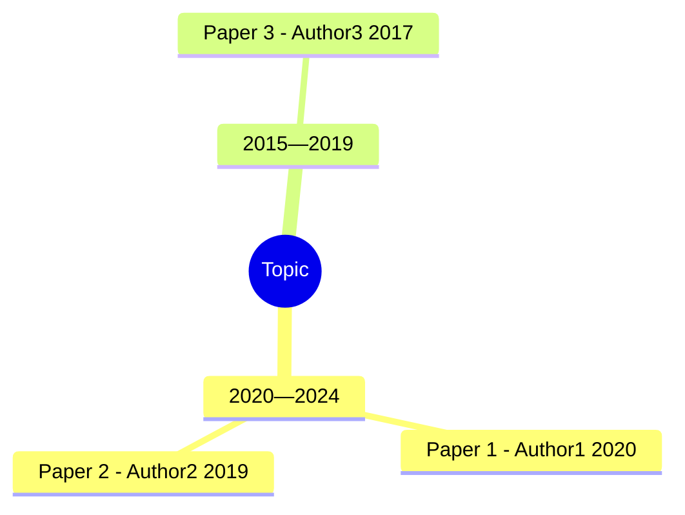

# Scientific Research Literature Review

Systematically research a scientific direction, find relevant literature, and clarify
the development trajectory. This skill is for **exploratory research** — when the user
wants to understand a field, not just find a few papers.

## Core Principles (Read First)

1. **Never fabricate.** Every citation must correspond to a real, verifiable
   publication. **Never invent a DOI** or any other identifier.
2. **Missing means missing.** If a metadata field (DOI, volume, issue, pages,
   etc.) cannot be retrieved, leave it empty in JSON output and render it as
   the literal string `"missing"` in human-readable formats. Do not guess.
3. **DOI-anchor every record.** Each paper that has a DOI is resolved against
   CrossRef and cross-checked on title + first-author surname + year. Records
   that fail anchoring are flagged `verified: false`.
4. **DOI-first deduplication.** When merging results from multiple sources,
   collapse by DOI (then arXiv id, PMID, normalized title+year) and keep the
   record with the most complete metadata. Source attributions are unioned.
5. **Stay on topic.** Only include papers directly relevant to the user's
   research direction.

## Operating Mode (Agent-Driven, NOT user-driven)

**The user must NEVER be asked to run any shell command.** This skill is fully
agent-driven: once the user states their research direction in natural language
(e.g., "帮我调研一下扩散模型在蛋白质设计中的发展脉络"), Claude Code itself
decides every CLI argument, executes the orchestrator via `run_command`, and
delivers the report. The user only sees:

  1. A short confirmation of the topic Claude Code interpreted.
  2. The path to the generated `<topic>领域发展脉络调研.md` on their Desktop.
  3. Optional follow-up narrative summary.

**Never** print a command and tell the user to run it. **Never** stop at "you
can run …". If the user has stated a topic, run the pipeline immediately.

## Workflow

### Step 1: Interpret the Research Direction (silent)

Read the user's natural-language request and **decide internally**:

- **English query** (`--query`): translate / refine the user's wording into a
  concise English search string (sources index in English). Drop polite filler
  ("帮我调研一下", "I want to know about"). Keep technical specifics.
- **Topic label** (`--topic`): the user-facing name shown in the report title
  and filename. Default to a short Chinese phrase if the user wrote in Chinese,
  otherwise the English query. Used in `<topic>领域发展脉络调研.md`.
- **Sources** (`--sources`): pick from the routing table below based on the
  topic's field. Default to **3 sources** for breadth + cross-validation.
- **Max results per source** (`--max-results`): default 25. Bump to 40 for
  broad / well-established fields, drop to 15 for narrow niches.
- **Year range** (`--year-from / --year-to`):
  - **用户指明两个具体年份**（如"2015年到2023年"、"between 2018 and 2022"）: 严格按照用户指定的区间设置 `--year-from` 和 `--year-to`，不得扩大或缩小范围。
  - **用户模糊提及近期**（如"近年"、"近年来"、"recent"、"recent years"）: 读取本地系统时间获取当前年份 `N`，设置 `--year-from = N - 3`（默认最近 3 年）。
  - **用户指明具体年数**（如"近四年"、"the past 5 years"）: 读取本地系统时间获取当前年份 `N`，设置 `--year-from = N - k`（`k` 为用户指定的年数）。
  - **用户未提及任何时间相关词汇**: 不主动询问用户，默认设置 `--year-from = N - 4`（近五年），并在报告元信息中标注"默认检索近五年文献"。
- **Type filter** (`--type`): leave as `all` unless the user asked specifically
  for "reviews / 综述" or "preprints".

Only ask a clarifying question if the topic is genuinely ambiguous (e.g., bare
acronym with multiple meanings). For medical-imaging queries, also see the
**Entity Deficiency Detection** rules below — missing modality/organ triggers a
mandatory follow-up. One question max; if the user answers vaguely, make your
best guess and proceed.

#### Intent Parsing & Entity Extraction (Medical Imaging)

When the user's query contains medical-imaging terms (ultrasound/CT/MRI/分割/
分类/检测/肺/心脏/脑/肝/肾 …), the script performs **dual-layer entity extraction**:

1. **Rule-based extraction (fast path)** — scan the query against the built-in
   synonym map (`scripts/lib/medical_synonyms.py`) to extract:
   - `modality` (影像模态): e.g. Ultrasound, CT, MRI, X-Ray
   - `organ` (器官/部位): e.g. Lung, Heart, Brain, Liver
   - `task` (任务类型): e.g. Segmentation, Classification, Detection

2. **LLM fallback (organ extraction only)** — if the rule-based parser returns
   `organ=None` but the query contains medical-imaging terms (any modality or
   task was matched), the script automatically calls the Anthropic Claude API
   to extract the organ directly from the raw query text. This **does not rely
   on the organs list** — the LLM understands medical terminology semantically.
   For example, even if "胃间质瘤" is not in the synonym map, the LLM will
   correctly extract `organ: "Stomach"`.

   **Why only organ?** The rule-based parser handles modality and task terms
   well (they are standardized and limited in number). The organ domain is vast
   and covers many condition-specific terms that a fixed synonym map cannot
   exhaustively cover. The LLM fallback bridges this gap.

#### Entity Deficiency Detection (Critical Gate)

After entity extraction (both rule-based and LLM-based if applicable), the agent
MUST evaluate whether the extracted intent is too vague for a focused literature
search. **This is a mandatory check before running the pipeline.**

The agent can verify via a lightweight pre-flight command:

```bash
"$PY" <skill-dir>/scripts/search-literature.py \
  --query "<user's original query>" \
  --deficiency-check
```

This prints a JSON object and exits with code 2 (deficient) or 0 (not deficient).
Parse the JSON to decide whether to proceed or ask the user.

**Deficiency thresholds:**

| Scenario | modality | organ | task | Action |
|----------|----------|-------|------|--------|
| Non-medical query | None | None | None | Proceed with generic search |
| Critical deficiency | None | None | Present | **MUST ask** follow-up |
| Partial deficiency | None | Present | Present | **Ask** follow-up |
| Partial deficiency | Present | None | Present | **Ask** follow-up |
| No deficiency | Present | Present | Any | Proceed with search |
| No deficiency (task-only OK) | Present | Present | None | Proceed with search |

**Critical deficiency examples** (both modality AND organ missing):
- "帮我找近年分割相关的论文" → task=Segmentation, modality=None, organ=None
- "找一些医学图像分类的最新研究" → task=Classification, modality=None, organ=None
- "detection in medical imaging" → task=Detection, modality=None, organ=None

**Partial deficiency examples** (one entity missing while the other + task exist):
- "超声分割" → modality=Ultrasound, task=Segmentation, organ=None
- "CT image segmentation" → modality=CT, task=Segmentation, organ=None
- "肺部病灶检测" → organ=Lung, task=Detection, modality=None

**No-deficiency examples** (both modality and organ present, or non-medical):
- "超声肺部病灶分割" → all three present
- "CT liver tumor classification" → all three present
- "diffusion models for protein design" → non-medical, proceed normally
- "肺部分割" → organ=Lung, task=Segmentation, modality=None — **still deficient (partial)**

**When deficiency is detected, the agent MUST stop and ask a clarifying
follow-up question BEFORE running the search pipeline.** Use the
`suggestion_cn` / `suggestion_en` from the JSON output, or this template:

> 我可以帮您查找**{task}**相关的论文。为了更准确地缩小检索范围，请问
> 您关注的是哪种**医学影像模态**（如超声、CT、MRI、X-Ray）以及
> **哪个器官或部位**（如肺部、肝脏、脑部、心脏、肾脏）呢？

For English-speaking users:

> I can help find papers related to **{task}**. To narrow the search,
> could you specify the **imaging modality** (e.g., ultrasound, CT, MRI,
> X-Ray) and the **anatomical region or organ** (e.g., lung, liver, brain,
> heart, kidney)?

**Non-medical queries:** If the query does not trigger any medical-imaging
entity extraction (all three fields are None and `has_medical_terms` is
false), do NOT trigger the deficiency check — proceed with the normal
generic search pipeline.

**After the user provides the missing entities:** Re-interpret the combined
context (original query + user's clarification) and proceed to Step 2 with
the updated query.

#### Entity Validation Before LLM Filtering (Critical)

**After entity extraction is complete (both rule-based + LLM fallback), BEFORE
running the search pipeline, the agent MUST verify that the organ entity is
present.** This is a strict prerequisite for LLM batch filtering.

- If `organ` is present (not None): proceed with the pipeline. The script will
  automatically invoke LLM batch filtering after dedup/verify.
- If `organ` is `None`: **DO NOT fabricate an organ entity.** Stop and ask the
  user to clarify. The script has already tried both the rule-based parser AND
  the LLM fallback — if both return `organ=None`, the query genuinely lacks
  an organ mention.

  **Agent-side LLM re-extraction** (if the script ran without API key and the
  rule-based parser returned organ=None, but you believe the query mentions an
  organ):

  ```
  The user's query is: "{original_query}"
  Rule-based extraction returned: modality={modality}, organ=None, task={task}

  Extract the organ (anatomical structure/region) from the query.
  Return ONLY a JSON object with keys "modality", "organ", "task".
  Use canonical English names. Use null if a field is not mentioned.
  ```

- If re-extraction still returns organ=None: **proceed with the pipeline but skip
  LLM filtering.** The report will include all papers matching the query without
  organ-level filtering. This is acceptable for broad queries.

#### LLM Batch Filtering Agent Prompt (Manual Fallback)

**Use this section only when `ANTHROPIC_API_KEY` is NOT configured** and the
pipeline runs in agent-manual mode. When the API key IS set, the script handles
batch filtering internally and this section is NOT needed.

Before running the pipeline, verify that the **organ entity is present** in the
extracted intent. If `organ` is `None`, ask the user to clarify which organ/region
they are interested in. **Never fabricate organ entities.**

After the pipeline returns deduplicated papers, if the organ entity is present,
run this prompt to filter the papers:

```
You are a scientific literature reviewer. Evaluate each paper below against
the user's research intent.

User query: {original_query}
Extracted entities:
- Modality: {modality or null}
- Organ: {organ}
- Task: {task or null}

For each paper, determine if it is directly relevant to the user's intent.
A paper is relevant if it:
1. Focuses on the specified organ/region (if specified), OR operates in a
   domain naturally implied by the organ (e.g. ovarian cancer for 'Ovary',
   cardiac imaging for 'Heart').
2. Uses the specified imaging modality (if specified), OR uses a strongly
   related modality in contexts where the user may not have specified an
   exact modality.
3. Relates to the specified task (if specified), OR addresses a fundamentally
   related task.

CRITICAL RULES:
- A paper about a DIFFERENT organ (e.g. breast vs ovary) MUST be marked
  irrelevant. Do not confuse different organs.
- A paper that is generally about medical AI but does NOT focus on the
  specified organ/modality MUST be marked irrelevant.
- A paper about the correct organ but a different modality (e.g. CT when
  user wants ultrasound) should be marked irrelevant UNLESS the paper is
  a cross-modality comparison where the organ is the same.
- If only the task is specified (no organ/modality), mark papers as
  relevant if they are about any medical imaging task.

Return ONLY a JSON array of booleans, one per paper in order.
Example: [true, false, true, false]

### PAPER 1
Title: {title1}
Abstract: {abstract1}

### PAPER 2
Title: {title2}
Abstract: {abstract2}
...
```

After receiving the JSON array, keep only the papers marked `true` and proceed
with report generation.

3. **Entity-to-keyword mapping** — after extraction, the script automatically:
   - **Augments** the search query with English synonyms (e.g. "超声" → adds
     "ultrasound us echography", "肺" → adds "lung pulmonary pulmo")
   - **Injects** NOT clauses for conflicting modalities only
     (e.g. if user wants "Ultrasound Lung", the query gets
     `NOT CT NOT MRI NOT X-Ray`. Organ-level NOT clauses are omitted because
     academic search APIs handle multi-word terms and CJK characters unreliably.)

4. **LLM Batch Post-Filter** — after papers are retrieved, deduplicated, and
   DOI-verified, the script runs an **LLM-based batch filter**:

   - **Prerequisite**: the `organ` entity MUST be extracted from the user's query.
     If `organ` is `None`, the script skips LLM filtering and all papers pass
     through. **The script MUST NOT fabricate organ entities** — if the organ is
     missing, the SKILL.md agent prompt will ask the user to clarify before
     proceeding.
   - The script packs all deduplicated papers (title + abstract) into a single
     batch prompt and calls the Anthropic Claude API (model: `claude-sonnet-4-6`).
   - The LLM returns a JSON array of booleans, one per paper. Papers marked
     `false` are semantically irrelevant to the user's intent (e.g., a paper
     about "breast cancer" is correctly excluded when the user asks about
     "ovarian cancer").
   - **Two execution paths**:
     1. **API direct call** (preferred): If `ANTHROPIC_API_KEY` is set, the script
        calls the API directly. Set `LLM_BATCH_FILTER=0` to disable.
     2. **Agent-manual fallback**: If no API key is configured, the agent
        (Claude Code) runs the batch filter step using its own API access,
        following the prompt in **LLM Batch Filtering Agent Prompt** below.

   The LLM prompt evaluates each paper against:
   - **Organ specificity**: A paper about a different organ MUST be excluded.
     Do not confuse "ovarian cancer" with "breast cancer".
   - **Modality matching**: A paper about the correct organ but a different
     modality should be excluded (unless it's a cross-modality comparison).
   - **Task relevance**: The paper's task must align with the user's intent.

5. This ensures that if a user asks for "超声肺分割", they will NOT receive
results like "CT心脏分割" — and additionally, papers about "breast cancer"
are correctly excluded when the user asks about "ovarian cancer" — even though
both are cancer-related and may share keywords like "tumor" or "cancer".

#### Source Routing Table (used by Step 1's source-decision logic)

| Topic's field | Primary | Secondary | Tertiary |
|---|---|---|---|
| Biomedical / life sciences / clinical | pubmed | semantic_scholar | crossref |
| CS / AI / ML / NLP / CV | arxiv | semantic_scholar | crossref |
| Physics / math / astronomy | arxiv | semantic_scholar | crossref |
| Chemistry / materials | crossref | semantic_scholar | pubmed |
| Engineering / robotics / signal | semantic_scholar | crossref | arxiv |
| Social science / humanities | crossref | semantic_scholar | (skip arxiv/pubmed) |
| Cross-disciplinary / unsure | semantic_scholar | crossref | arxiv |

**Default**: pick the top-3 sources for the matched field and pass them all in
one invocation. Picking only one source is forbidden unless the topic clearly
fits a single domain (e.g., pure-math → arxiv only).

### Step 2: Execute the Pipeline (silent)

Invoke the orchestrator with `run_command`. There is exactly one canonical
shape:

```bash
# Detect python: prefer python3, fall back to python, error only if neither exists.
PY=$(command -v python3 2>/dev/null || command -v python 2>/dev/null)
if [ -z "$PY" ]; then
  echo "Error: No Python runtime found. Please install Python 3.x." >&2
  exit 1
fi
"$PY" /Users/<user>/.comate/skills/scientific-research/scripts/search-literature.py \
  --query "<refined English query>" \
  --topic "<user-facing topic name>" \
  --sources "<chosen,sources>" \
  --max-results <N> \
  [--year-from <Y>] [--year-to <Y>] [--type review] \
  --report \
  --quiet
```

Notes for the agent:
- Use the absolute path of `search-literature.py` in this skill's directory
  (it is symlinked / installed under the user's Comate skills tree). Resolve
  the path from `__file__` of the skill, never hard-code a username.
- Always pass `--report` (this is the deliverable).
- Always pass `--quiet` so the user only sees the final `[report] <path>` line.
- Capture stdout; the last line is the report path.
- If the script exits non-zero, retry once with a single fallback source
  (`crossref` is the most reliable). If that also fails, surface a concise
  error and the partial output (if any).
- The python detection block (`PY=$(command -v python3 ...`) is mandatory in
  every invocation. It silently prefers `python3`, falls back to `python`, and
  prints a single human-readable error **only** when neither is available.

#### Intent-aware pipeline internals

When the query contains medical-imaging terms, the script performs these additional
steps automatically (the agent does NOT need to pass extra flags):

1. **Pre-search**: builds an augmented query with English synonyms + NOT clauses
   for conflicting modalities only (organ-level NOT clauses are omitted).
2. **Search**: sends the augmented query to all sources.
3. **Dedup & Verify**: deduplicates by DOI, verifies via CrossRef.
4. **LLM Batch Filter** (new): after dedup/verify, if the `organ` entity is
   present, the script calls the Claude API to semantically filter papers.
   Papers about unrelated organs (e.g. "breast cancer" for an "ovarian cancer"
   query) are correctly excluded. If `organ` is missing, LLM filtering is
   skipped — see **LLM Batch Filtering Agent Prompt** below for the manual
   fallback.
5. The agent can see the intent parsed from stderr logs (e.g. `[intent] modality=Ultrasound, organ=Lung`)
   for debugging, but this is hidden from the user via `--quiet`.

The orchestrator handles internally: rate-limiting, retry, HTTP cache, DOI
anchoring against CrossRef, retraction detection, dedup, mindmap and report
generation, and writing to the Desktop.

### Step 3: Confirm Delivery and Add Narrative

After the script returns:

1. Read the generated Markdown file with `read_file` to verify it exists and
   has non-empty content (Overview + Literature List + Mindmap).
2. If `unique_count` is unusually low (< 5) or high (> 80), re-run once with
   adjusted `--max-results` or sources. Do this without asking the user.
3. Reply to the user with:
   - A one-paragraph executive summary of what was found.
   - The absolute path to the report on their Desktop, formatted as
     `file_path:line_number` so the IDE makes it clickable
     (e.g., `~/Desktop/扩散模型在蛋白质设计中的发展脉络领域发展脉络调研.md:1`).

**Do NOT** dump the entire report into chat — the user already has the file.

## Legacy Reference: Pipeline Internals

The sections below describe what the orchestrator does internally. The agent
never asks the user to invoke any of this manually.

**Implemented sources (HTTP, no key required):**
- `crossref` — CrossRef Works API (set `SCI_RESEARCH_MAILTO` for polite pool)
- `semantic_scholar` — Semantic Scholar Graph API (set `SEMANTIC_SCHOLAR_API_KEY` if available)
- `arxiv` — arXiv Atom API (requires ≥3 s between calls; best for CS / AI / ML)
- `pubmed` — NCBI E-utilities (set `NCBI_API_KEY` for higher quotas; best for biomedical)

**Fault tolerance:** each source retries up to 3 times on network errors (timeout,
DNS failure, connection refused). After 3 retries the source is silently skipped —
no exception propagates, no error is shown to the user. The pipeline continues with
remaining sources.

**Network note for mainland China users:** Some sources (Semantic Scholar, arXiv,
NCBI) may be slow or unreachable. If a source times out, it will be automatically
skipped after 3 retries. CrossRef is generally the most reliable. If only crossref
returns results, the report is still complete — just with fewer records.

## Output Structure

```markdown
## Literature Review: [Topic]

### Overview
Brief description of the field, its size, and main themes.

### Literature List
| # | Year | Title | Venue | DOI | Sources |
|---|------|-------|-------|-----|---------|
| 1 | 2020 | ... | Journal Name | 10.xxxx/yyyy | crossref, semantic_scholar |
| 2 | 2021 | ... | missing | arxiv |

### Mind Map

```

## Orchestrator CLI Reference (for the AGENT, not for the user)

> **Reminder**: never paste these commands to the user. The agent runs them
> via `run_command` in Step 2 above. Documented here only so the agent knows
> which flags exist.

### Canonical invocation (always used in --report mode)

```bash
# Detect python: prefer python3, fall back to python, error only if neither exists.
PY=$(command -v python3 2>/dev/null || command -v python 2>/dev/null)
if [ -z "$PY" ]; then
  echo "Error: No Python runtime found. Please install Python 3.x." >&2
  exit 1
fi
"$PY" <skill-dir>/scripts/search-literature.py \
  --query "<refined English query>" \
  --topic "<user-facing topic name>" \
  --sources "<comma list, 1-4 of: arxiv,crossref,pubmed,semantic_scholar>" \
  --max-results <N> \
  [--year-from <Y>] [--year-to <Y>] [--type {all,review,preprint,article}] \
  --report \
  --quiet
```

The script writes `<topic>领域发展脉络调研.md` to the user's Desktop
(auto-detected: `~/Desktop`, `~/桌面`, or `~/デスクトップ`; override with
`--report-dir PATH` or env `SCI_RESEARCH_REPORT_DIR`). The report contains:

1. 元信息（生成时间、query、源、文献规模、年份范围）
2. 领域概览
3. 文献列表（按年份降序，6 列精简格式，新增 Venue 列）
4. Mermaid 思维导图（按 5 年时间桶）

Skeleton (every table row, every Mermaid leaf, every section header) is
generated **mechanically from real papers with valid identifiers**. The LLM's job
is minimal — no synthesis prose is expected.

**Why Markdown?** Across LLM-produced formats, Markdown has the lowest
syntactic-error rate, renders identically in GitHub / VS Code / Obsidian /
Typora / chat tools, and degrades gracefully to plain text.

### All flags (reference only)

- `--sources` comma list of `arxiv,crossref,pubmed,semantic_scholar`
- `--max-results N` per source
- `--year-from / --year-to` filter
- `--type {all,review,preprint,article}` (where the source supports it)
- `--no-verify` skip CrossRef anchoring (only for debugging)
- `--drop-unverified` keep only DOI-anchored records
- `--export {json,bibtex,ris,nbib,markdown}` (used by debug paths only)
- `--output PATH` write the export to a file (default: stdout)
- `--report` write the full `<topic>领域发展脉络调研.md` to the Desktop
- `--topic STR` topic name used in the report title and filename
- `--report-dir PATH` override the report output directory
- `--quiet` suppress progress logs (always pass this in agent mode)

**Environment variables:**
- `ANTHROPIC_API_KEY`: Required for LLM batch filtering. If set, the script
  automatically calls the Claude API to semantically filter papers after
  deduplication.
- `LLM_BATCH_FILTER`: Set to `0` to disable LLM batch filtering entirely
  (default: enabled). Useful for debugging or when API key is not available.
- `SCI_RESEARCH_CACHE`: Override the default HTTP cache directory.
- `SCI_RESEARCH_REPORT_DIR`: Override the default report output directory.
- `SCI_RESEARCH_MAILTO`: Polite pool email for CrossRef API.

Stdlib-only — no `pip install` needed. HTTP cache lives at
`~/.cache/scientific-research/` (override with `SCI_RESEARCH_CACHE`).

Records without a DOI are kept but marked `verified: false`. Use
`--drop-unverified` to filter them out.

## Deduplication Rules

Records are bucketed by the first available key:
1. `doi` (normalized to lowercase, no URL prefix)
2. `arxiv_id` (versionless)
3. `pmid`
4. Normalized title + year (last-resort, fuzzy)

Within a bucket, the record with the higher *completeness score* (weighted sum
over DOI / title / authors / year / venue / volume / issue / pages / abstract /
PMID / arXiv id / publisher / citation count) wins. The loser's metadata is
merged in for any field the winner left empty. The `sources` list is the union
across all merged records.

## Error Handling

- **No results found**: broaden query terms, try synonyms, suggest related topics.
- **API / source failure**: source clients fail open — they return `[]` and the
  pipeline continues with remaining sources. Network retries with exponential
  backoff are built in.
- **Uncertain citation**: when in doubt, exclude the paper rather than risk
  fabricating.

## Limitations

- Google Scholar / CNKI / 万方 lack public APIs — use WebSearch / WebFetch manually
  for those and feed verified results into your synthesis.
- Citation counts may lag (CrossRef updates monthly; Google Scholar may lag).
- Preprints may later appear in journal form.
- Paywalled content: only cite the metadata; never fabricate abstracts you cannot read.
- Semantic Scholar API rate limit: ~100 requests / 5 min unauthenticated.
- DOI 验证已启用：通过 CrossRef API 对每条含 DOI 的文献进行锚定验证（标题+第一作者+年份三元组比对），`verified=false` 的文献会被标记但保留在结果中。
- **中国大陆网络环境**：Semantic Scholar / arXiv / NCBI 可能连接缓慢或不可达。每个源
  自动重试 3 次，超时后静默跳过，不会报错。通常 crossref 是最可靠的源。
- Always prefer verified data over plausible-sounding estimates. When uncertain
  about citation counts or venue impact factors, state that explicitly rather
  than guessing.
